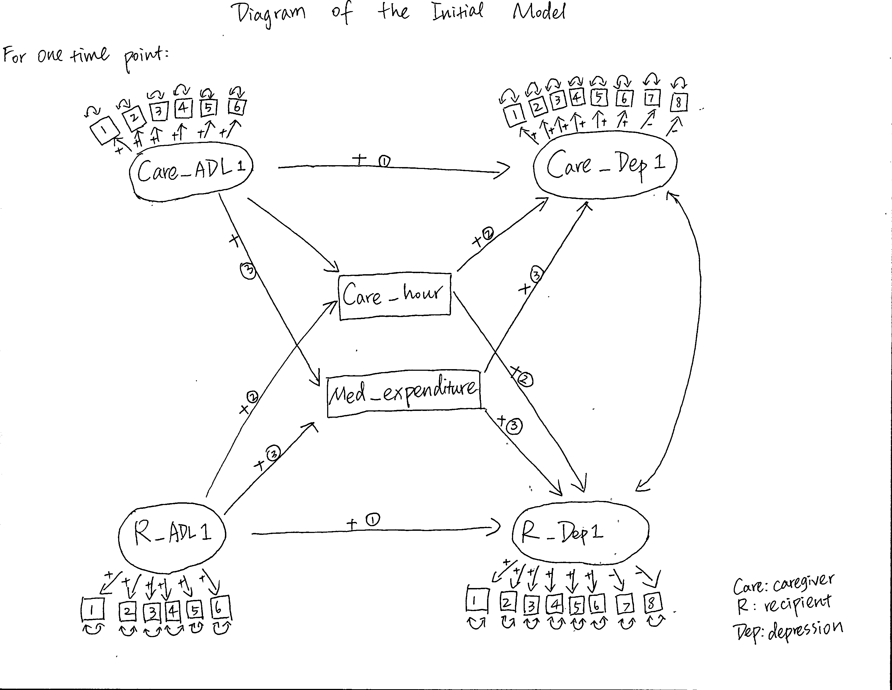
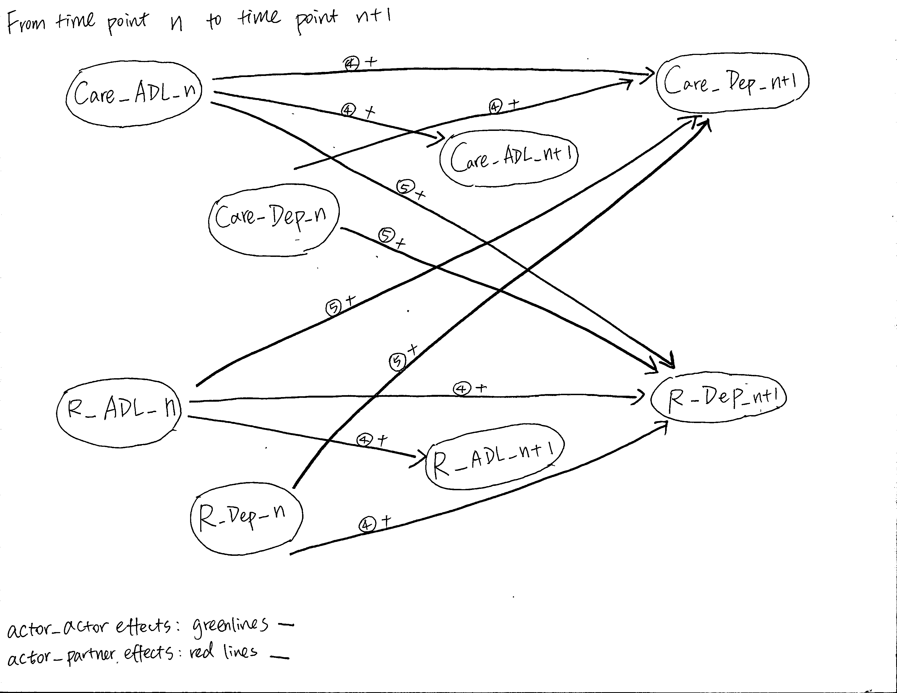

# Section I. Purpose
### General topic
Existed research using multiple regression on data from wave 2006, 2008, 2010, 2012 has found that spousal caregiving carries a risk of depression, and symptoms are likely to peak near the end of the caregiving episode (Kaufman et. al., 2019). In our research, we are specifically interested in those older adults who experienced cognitive decline. We want to investigate how their cognitive function and depression and the their spousal caregivers' cognitive function and depression affect one another over time. We want to implement structural equation modeling and use more recent four waves from 2010, 2012, 2014, and 2016 to prove the existence of the effect of the elevated risk of depression among spousal caregivers. We also want to look at how caregiving recipients' depression and development of cognitive decline are affected by caregivers into and out to this relationship. Further, we want to learn whether that effect is moderated by caregiving hours and medical expenditure.   

### Focused hypotheses
1. For each individual in one year, his or her cognitive decline will have positive effects on the depression.         

2. An increase in a caregiving recipient's cognitive decline will require more caregiving hours and increase the recipient's and the caregiver's depression. 

3. An increase in both caregiver and recipient's cognitive decline leads to higher medical expenditure, and thus aggravates depressive symptoms.      

4. Actor-Actor effect over time: At time point one, caregiver's cognitive function will affect his/her own cognitive function and depression at time point two, and caregiver's depression will affect his/her depression at time point two. Similarly, recipient's cognitive function will affect on his/her own cognitive function and depression at time point to, and the recipient's depression at time point one will affect his/ her own depression at the point two. We hypothesis that all actor-actor effects over time will be positive. Effects from time point one to time point two will also carry on for time point three and time point four.    

5. Actor-Partner effect over time: At time point one, caregiver's cognitive decline and depression will affect the recipient's depression at time point two. Similarly, the recipient's cognitive decline and depression will affect his/her caregiver's depression at time point two. We hypothesis that all actor-partner effects over time will be positive. Effects from time point one to time point two will also carry on for time point three and time point four.

6. For four groups of caregivers (a. enter caregiving; b. exit caregiving; c.  continuing caregiving; d. not providing spousal caregiving), the effects of the model are different from each other, which is tested by repeating the model for four times. We hypothesize that the caregivers' cognitive decline and depression will be highest near the end of the caring episode.

# Section II. Data
Public survey data: http://hrsonline.isr.umich.edu/
It includes data for different sections, such as household, daily activities, psychosocial factors, and so on.     

Restricted data (ADAMS) for dementia (we are requiring access to this data): http://hrsonline.isr.umich.edu/index.php?p=healthdat#access
It specifically focuses on measurement related to dementia.      
    
### Data description
This data is from the Health and Retirement Study (HRS), a longitudinal, nationally representative panel survey of U.S. adults aged $\geq 50$ years and their caregivers. The HRS conducts in-person or telephone surveys biennially.     

# Section II. Population
Ideally, we want to have recipients to match up with their caregivers, which gives us row per dyad, a combination of one recipient and his/her caregiver. A unique ID is given to each dyad. 
For each dyad, all variables repeat for four waves. 

We want to generalize the phenomenon to all older couples $\geq 50$years old who experience cognitive decline.      

# Section III. Model
### Endogenous variable (a latent variable)
Depression Scale (a short version of the Center for Epidemiological Studies Depression Scale: CES-D, designed for telephone interviews with older respondents) (Turvey, Wallace, & Herzog, 1999)    

Measured by eight indicators:  

Six unfavorable indicators: 1. always or much of the time feeling depressed, 2.sad, or 3.lonely, 4.feeling that everything is an effort, 5. feeling unable to get going, or 6.having restless sleep        

Two favorable indicators(reverse scored): 1.feeling happy, 2.enjoying life      
Each indicator has two levels, either yes or no.       

### Exogenous variables   
Activities of daily living (a latent variable), a well-recognized measurement for testing the existence of cognitive decline.       

Measured by six indicators: 1.walk across a room, 2.shower or bathe, 3.eat, 4. get in or out of bed, 5.use the toilet, 6.dress themselves
Each indicator is measured by 1 (yes) or 0 (no).      

Caregiving hours (quantitative variable): measured by hours per day       

Medical expenditure (quantitative variable): measured by the total amount of dollars one needs to pay out of pocket for health service   

### Longitudinal Model
The model is repeated four times to investigate the different effects on four groups of caregivers 

# Model Diagram
### Diagram I.

### Diagram II.
  

The mediators and the indicators for the latent variables are not specified in this longitudinal diagram.   

# Reference
Kaufman, J. E., Lee, Y., Vaughon, W., Unuigbe, A., & Gallo, W. T. (2019). Depression Associated With Transitions Into and Out of Spousal Caregiving. The International Journal of Aging and Human Development, 88(2),127-149. https://doi.org/10.1177/0091415018754310
